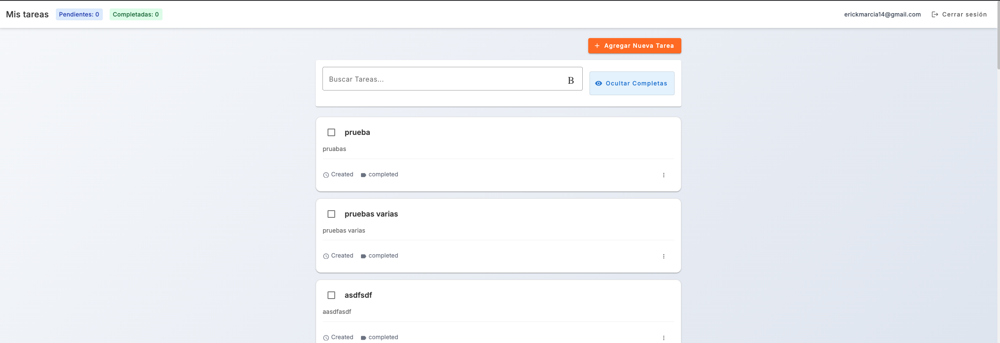

# 📝 Angular To-Do App

Aplicación web desarrollada en **Angular 17** para la gestión de tareas (To-Do list), con integración a un backend construido en Firebase Functions y Firestore.

---

## 🚀 Tecnologías Utilizadas

- **Angular 17**: Framework principal del frontend.
- **TypeScript**: Tipado estático para mayor robustez.
- **Angular Material**: UI moderna y accesible.
- **TailwindCSS**: Estilos utilitarios para diseño rápido y responsivo.
- **RxJS**: Manejo de flujos de datos reactivos.
- **SweetAlert2**: Alertas personalizadas para una mejor UX.
- **Firebase Firestore**: Base de datos en tiempo real.
- **Firebase Functions**: API serverless para operaciones CRUD.

---

## 🎨 Decisiones de Diseño

- **Arquitectura limpia y modular**: Separación clara entre vistas, servicios, modelos y componentes compartidos.
- **Uso extensivo de Observables y Subjects**: Para asegurar reactividad y sincronización de la UI en tiempo real.
- **Componentes reutilizables**: Diseñados para ser fácilmente adaptables a nuevos contextos.
- **Mensajes visuales amigables**: A través de **SweetAlert2**, con confirmaciones y errores amigables.

---

## 📁 Estructura del Proyecto
```bash
/ (raíz)
src/
├── app/
│   ├── core/             # Servicios y lógica de negocio
│   ├── shared/           # Componentes, pipes y directivas reutilizables
│   ├── pages/            # Componentes de páginas
│   ├── models/           # Interfaces y DTOs
│   └── app-routing.module.ts
├── assets/               # Imágenes, estilos globales, etc.
├── environments/         # Configuración para distintos entornos
└── README.md
```

## 🧪 Cómo Ejecutar Localmente

1. Instala Node.js 20:
```bash
   nvm install 20
   nvm use 20
```


2.	Instala las dependencias:
```bash
  npm install
```

3.	Inicia el servidor de desarrollo:
```bash
  ng serve
```

4.	Visita http://localhost:4200 para ver la app.

🔐 Asegúrate de tener configurado Firebase y habilitadas las funciones necesarias.

⸻

📷 Capturas de Pantalla



## comandos usados
ng g s core/auth/auth --skip-tests
ng g g core/auth/auth

ng g i features/tasks/models/task


# Component
ng g c features/auth/pages/login --standalone --skip-tests
ng g c features/tasks/pages/task-list --standalone --skip-tests
ng g c features/tasks/components/task-item --standalone --skip-tests
ng g c features/tasks/components/task-form --standalone --skip-tests
ng g c core/shared/components/confirm-dialog --standalone --skip-tests


# Servicios
ng g s core/auth/auth
ng g s core/http/api
ng g s features/tasks/services/task


# Interface
ng g i core/auth/user
ng g i features/tasks/models/task


# Guard
ng g g core/auth/auth --functional


# Interceptor
ng g i core/http/error --functional


# Pipe
ng g p core/shared/pipes/short-date --standalone


